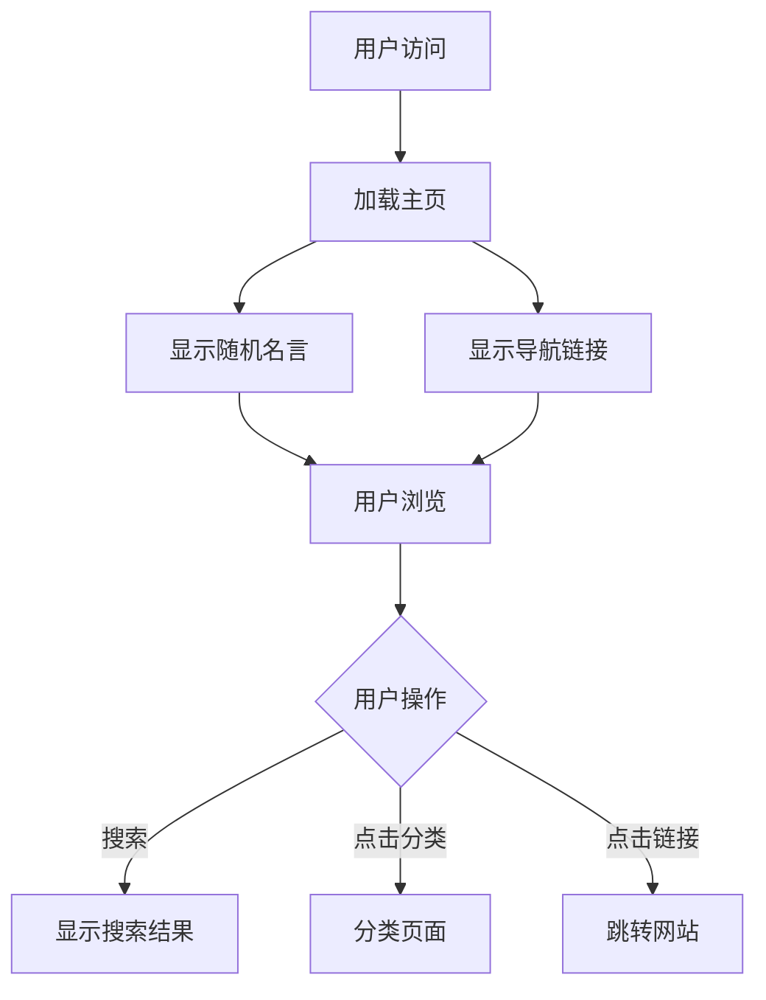

## 1. 产品概述
现代化导航网站，采用简约设计风格，使用React+TypeScript+Vite技术栈构建。核心功能是在页面上随机显示双语名言警句，为用户提供每日灵感。

目标用户：需要简洁高效导航体验的互联网用户，同时希望在浏览时获得精神激励。

## 2. 核心功能

### 2.1 用户角色
本网站为公共访问，无需用户注册和登录系统。

### 2.2 功能模块
网站包含以下核心页面：
1. **主页**：导航链接展示、随机名言显示、搜索功能
2. **分类页面**：按类别组织的导航链接
3. **管理页面**（可选）：导航链接的添加和编辑

### 2.3 页面详情
| 页面名称 | 模块名称 | 功能描述 |
|---------|---------|---------|
| 主页 | 导航栏 | 显示网站logo和主要导航菜单 |
| 主页 | 搜索框 | 允许用户快速搜索导航链接 |
| 主页 | 导航网格 | 以卡片形式展示常用网站链接，支持分类显示 |
| 主页 | 随机名言 | 从JSON文件随机读取并显示一句中英文对照的名言 |
| 主页 | 页脚 | 显示版权信息和联系方式 |
| 分类页面 | 分类导航 | 按不同类别（如工具、娱乐、学习等）组织链接 |
| 分类页面 | 链接列表 | 显示该类别下的所有导航链接 |

## 3. 核心流程
用户访问流程：
1. 用户进入主页，看到简约的导航界面
2. 页面加载时自动从JSON文件随机选择一句名言显示
3. 用户可以通过搜索框快速查找需要的网站
4. 用户可以点击分类查看相关链接
5. 用户点击导航卡片直接跳转到目标网站

## 4. 用户界面设计

### 4.1 设计风格
- **主色调**：纯白色背景 (#FFFFFF) + 深灰色文字 (#2D3748)
- **强调色**：天蓝色 (#3182CE) 用于链接和按钮
- **按钮样式**：圆角矩形，hover时有轻微阴影效果
- **字体**：系统默认字体，标题使用较大字号 (24-32px)，正文14-16px
- **布局风格**：卡片式网格布局，响应式设计
- **图标风格**：使用简洁的线性图标

### 4.2 页面设计概览
| 页面名称 | 模块名称 | UI元素 |
|---------|---------|--------|
| 主页 | 导航栏 | 居中logo，简约文字，无背景色 |
| 主页 | 搜索框 | 圆角输入框，占位符文字，搜索图标 |
| 主页 | 导航网格 | 白色卡片，圆角边框，悬停阴影，4列网格布局 |
| 主页 | 随机名言 | 居中显示，中英文分行，优雅字体，淡入动画 |
| 主页 | 页脚 | 极简设计，仅包含必要信息 |

### 4.3 响应式设计
采用桌面优先设计，完美适配各种屏幕尺寸：
- 桌面端：4列网格布局
- 平板端：2-3列网格布局  
- 手机端：1列垂直布局
- 触摸优化：增大点击区域，适合手指操作

### 4.4 动画效果
- 随机名言：每次刷新页面时的淡入淡出效果
- 导航卡片：hover时的轻微放大和阴影变化
- 页面切换：平滑的过渡动画