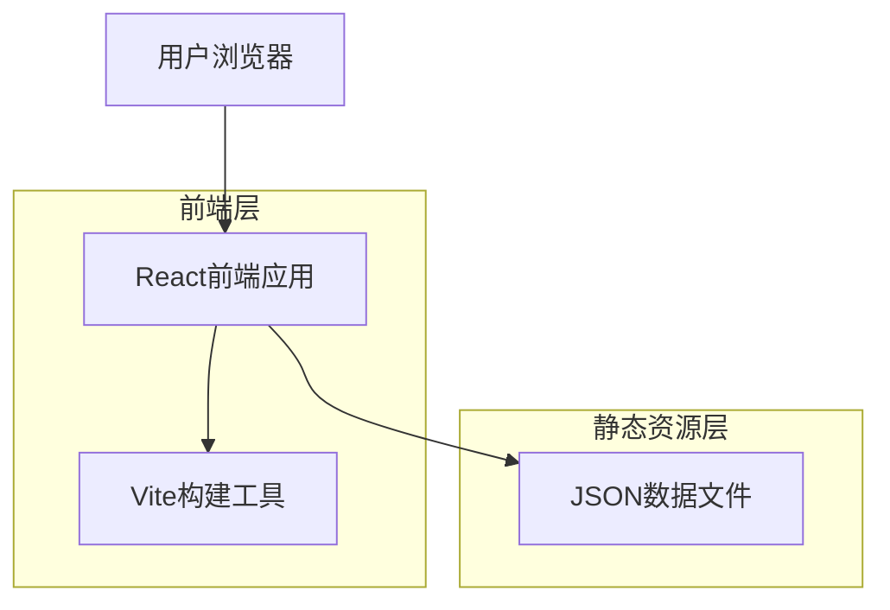

## 1. 架构设计



## 2. 技术描述

- **前端框架**: React@18 + TypeScript@5 + Vite@5
- **初始化工具**: vite-init
- **样式方案**: Tailwind CSS@3
- **状态管理**: React Hooks (useState, useEffect)
- **路由**: React Router@6
- **图标库**: Lucide React
- **动画库**: Framer Motion
- **后端**: 无（纯静态网站）

## 3. 路由定义

| 路由 | 用途 |
|------|------|
| / | 主页，显示导航链接和随机名言 |
| /category/:id | 分类页面，显示特定类别的链接 |
| /search | 搜索结果页面 |

## 4. 项目结构

```
src/
├── components/          # 可复用组件
│   ├── NavigationCard/  # 导航卡片组件
│   ├── SearchBox/       # 搜索框组件
│   ├── QuoteDisplay/    # 名言显示组件
│   └── Layout/          # 布局组件
├── pages/               # 页面组件
│   ├── Home/           # 主页
│   └── Category/       # 分类页
├── data/               # 静态数据
│   ├── quotes.json     # 名言数据
│   └── navigation.json # 导航链接数据
├── hooks/              # 自定义Hooks
│   └── useQuotes.ts   # 名言相关逻辑
├── types/              # TypeScript类型定义
│   ├── quote.ts       # 名言类型
│   └── navigation.ts  # 导航类型
└── utils/              # 工具函数
    └── random.ts       # 随机选择函数
```

## 5. 数据模型

### 5.1 名言数据结构
```typescript
interface Quote {
  id: string;
  chinese: string;
  english: string;
  author?: string;
  category?: string;
}
```

### 5.2 导航链接数据结构
```typescript
interface NavigationLink {
  id: string;
  name: string;
  url: string;
  icon?: string;
  category: string;
  description?: string;
  color?: string;
}

interface Category {
  id: string;
  name: string;
  icon: string;
  color: string;
}
```

### 5.3 示例数据格式

**quotes.json**
```json
[
  {
    "id": "1",
    "chinese": "学而时习之，不亦说乎？",
    "english": "Is it not pleasant to learn with a constant perseverance and application?",
    "author": "孔子",
    "category": "education"
  }
]
```

**navigation.json**
```json
{
  "categories": [
    {
      "id": "tools",
      "name": "工具",
      "icon": "wrench",
      "color": "#3182CE"
    }
  ],
  "links": [
    {
      "id": "1",
      "name": "GitHub",
      "url": "https://github.com",
      "category": "tools",
      "description": "代码托管平台",
      "color": "#24292e"
    }
  ]
}
```

## 6. 核心组件实现要点

### 6.1 随机名言显示组件
```typescript
// components/QuoteDisplay/QuoteDisplay.tsx
import { useEffect, useState } from 'react';
import { Quote } from '@/types/quote';
import quotesData from '@/data/quotes.json';

const QuoteDisplay: React.FC = () => {
  const [currentQuote, setCurrentQuote] = useState<Quote | null>(null);
  
  useEffect(() => {
    const randomQuote = quotesData[Math.floor(Math.random() * quotesData.length)];
    setCurrentQuote(randomQuote);
  }, []);
  
  return (
    <div className="quote-container">
      {currentQuote && (
        <>
          <p className="chinese">{currentQuote.chinese}</p>
          <p className="english">{currentQuote.english}</p>
          {currentQuote.author && (
            <p className="author">—— {currentQuote.author}</p>
          )}
        </>
      )}
    </div>
  );
};
```

### 6.2 响应式导航网格
```typescript
// components/NavigationGrid/NavigationGrid.tsx
import { NavigationLink } from '@/types/navigation';

interface NavigationGridProps {
  links: NavigationLink[];
}

const NavigationGrid: React.FC<NavigationGridProps> = ({ links }) => {
  return (
    <div className="grid grid-cols-1 md:grid-cols-2 lg:grid-cols-4 gap-4">
      {links.map(link => (
        <NavigationCard key={link.id} link={link} />
      ))}
    </div>
  );
};
```

## 7. 性能优化

- **代码分割**: 使用React.lazy进行路由级别的代码分割
- **图片优化**: 使用WebP格式，实现响应式图片
- **缓存策略**: 配置Vite的缓存策略，提升二次加载速度
- **预加载**: 对关键资源进行预加载
- **构建优化**: 启用Gzip压缩，移除console.log等调试代码